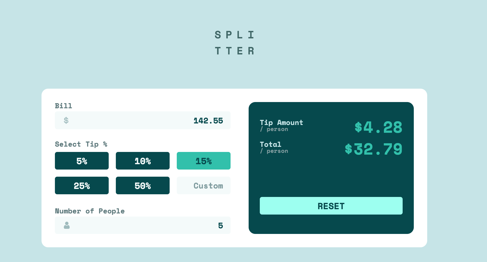

# Frontend Mentor - Tip calculator app solution

This is a solution to the [Tip calculator app challenge on Frontend Mentor](https://www.frontendmentor.io/challenges/tip-calculator-app-ugJNGbJUX). Frontend Mentor challenges help you improve your coding skills by building realistic projects.

## Table of contents

- [Overview](#overview)
  - [The challenge](#the-challenge)
  - [Screenshot](#screenshot)
  - [Links](#links)
- [My process](#my-process)
  - [Built with](#built-with)
  - [What I learned](#what-i-learned)
  - [Continued development](#continued-development)
  - [Useful resources](#useful-resources)

## Overview

### The challenge

Users should be able to:

- View the optimal layout for the app depending on their device's screen size
- See hover states for all interactive elements on the page
- Calculate the correct tip and total cost of the bill per person

### Screenshot




### Links

- Solution URL: [Add solution URL here](https://your-solution-url.com)
- Live Site URL: [Add live site URL here](https://your-live-site-url.com)

## My process

### Built with

- Semantic HTML5 markup
- CSS custom properties
- Flexbox
- CSS Grid
- Mobile-first workflow


### What I learned

1. Grid template
```css
main.card {
  display: grid;
  grid-template-areas: 
      "bill total"
      "tips total"
      "people total";
  column-gap: 5%;
}
.bill { grid-area: bill; }
.tips { grid-area: tips; }
.people { grid-area: people; }
.total { grid-area: total; }
```

2. Visibility property to hide/show
```css
.invalid-msg {
    visibility: hidden;
    position: absolute;
    right: 0;
    bottom: 4.15rem;
}
.invalid-msg.invalid {
    visibility: visible;
}
```

3. e.target.value
```js
btns.forEach((btn) => {
  btn.addEventListener('click', (e) => {
    const clicked = e.target; // html Element
    const btnEl = e.target.value; // Input value input or set in HTML
  });
});
```

4. Number.prototype.toFixed(num)
```js
billPerPerson = parseFloat(billPerPerson.toFixed(2));
```


### Continued development

1. Planning and staging
  - for this challenge, I didn't think ahead of HTML structure and css, hence having to go back and forth to style and restyle elements.
2. Display in different browsers
  - This time I used Google Chrome and Firefox and realised that there are differences between the browsers how styling appears or sometimes doesn't even appear correctly.


### Useful resources

- [MDN Web Docs](https://developer.mozilla.org/en-US/) - This helped me understand css grid systems and JavaScript.
